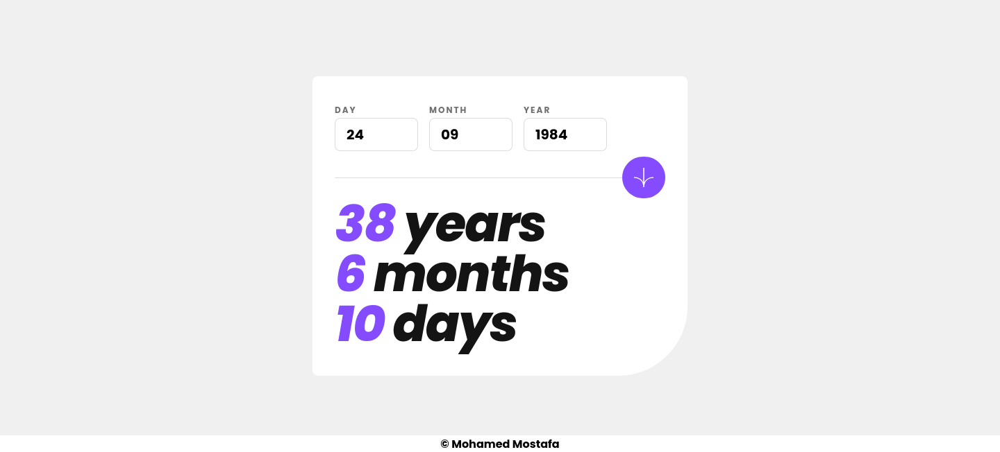

## What I Learned

- I learned how to make numbers animate to their finale values using Spring library

```js
import { useSpring, animated } from "@react-spring/web";

function Number({ from, to }) {
  const { number } = useSpring({
    from: { number: +from },
    number: to,
    delay: 200,
    config: { mass: 1, tension: 20, friction: 10 },
  });

  return <animated.div>{number.to((n) => n.toFixed(0))}</animated.div>;
}
```

## Screenshots

### Desktop



### Mobile


